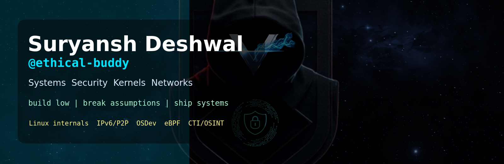

<p align="center">
  
</p>

<p align="center">
  <a href="https://github.com/ethical-buddy"></a>
  <a href="https://suryansh-deshwal.vercel.app/"></a>
  <a href="https://www.linkedin.com/in/suryansh-deshwal-7372b0262"></a>
</p>

<p align="center">
  
  
  
  
</p>

<h2 align="center">Systems & Security Engineer building close to the machine.</h2>

<p align="center">
  <b>OSDev . Linux internals . IPv6/P2P networking . eBPF . CTI/OSINT . distributed infrastructure</b>
</p>

```console
ethical-buddy@github:~$ ./profile --load

USER        Suryansh Deshwal
HANDLE      ethical-buddy
ROLE        Systems & Security Engineer
BUILDS      kernels, network runtimes, terminal tools, security research labs
PLATFORM    Linux
EDITOR      Neovim / Vim
MISSION     Build low. Break assumptions. Ship useful systems.
```

> I do not just want to use systems. I want to know why they work, where they fail, and how to build better ones.

<br/>

<table>
  <tr>
    <td width="33%" align="center">
      <h2>Kernel</h2>
      <p><b>syscalls . memory . VFS . tracing . eBPF</b></p>
    </td>
    <td width="33%" align="center">
      <h2>Network</h2>
      <p><b>IPv6 . P2P . relays . DHT . packets</b></p>
    </td>
    <td width="33%" align="center">
      <h2>Security</h2>
      <p><b>OSINT . RE . runtime security . threat intel</b></p>
    </td>
  </tr>
</table>

<br/>

## Featured Builds

<table>
  <tr>
    <td width="50%" valign="top">
      <h2>VX6</h2>
      <h3>IPv6-native decentralized networking</h3>
      <p><b>A self-hosting fabric for persistent node identity, encrypted forwarding, service discovery, DHT lookup, relays, and peer-to-peer infrastructure.</b></p>
      <p>
        <a href="https://github.com/ethical-buddy/vx6"></a>
        
      </p>
    </td>
    <td width="50%" valign="top">
      <h2>BumbelBee</h2>
      <h3>Operating system from scratch</h3>
      <p><b>A POSIX-inspired OS project for exploring boot, memory, interrupts, execution, syscalls, processes, filesystems, and kernel architecture.</b></p>
      <p>
        <a href="https://github.com/ethical-buddy/BumbelBee"></a>
        
      </p>
    </td>
  </tr>
  <tr>
    <td width="50%" valign="top">
      <h2>Vimgo</h2>
      <h3>Terminal-first file management</h3>
      <p><b>A keyboard-driven Linux file manager written in Go for people who would rather stay in the terminal.</b></p>
      <p>
        <a href="https://github.com/ethical-buddy/Vimgo"></a>
        
      </p>
    </td>
    <td width="50%" valign="top">
      <h2>KERNEL-HACKING</h2>
      <h3>Experiments below userspace</h3>
      <p><b>A practical playground for understanding kernel behavior, low-level interfaces, tracing, security, and implementation details through experiments.</b></p>
      <p>
        <a href="https://github.com/ethical-buddy/KERNEL-HACKING"></a>
        
      </p>
    </td>
  </tr>
</table>

<br/>

## Achievements & Signal

<table>
  <tr>
    <td width="38%" align="center">
      <h2>Head Organizer</h2>
      <h3>CyberSecure-X</h3>
    </td>
    <td width="62%">
      <p><b>Led CyberSecure-X at IDIAS as a first-of-its-kind on-device physical network, real-world CTF organized in September 2025.</b></p>
      <p>Built around hands-on security thinking: real devices, real network behavior, practical exploitation paths, and competition pressure closer to real infrastructure than a normal browser-only CTF.</p>
    </td>
  </tr>
  <tr>
    <td align="center">
      <h2>Open Source</h2>
      <h3>Upstream work</h3>
    </td>
    <td>
      <p><b>Contributed to OWASP Juice Shop / MultiJuicer and Sniffnet.</b></p>
      <p>Comfortable reading unfamiliar codebases, landing targeted changes, and working inside real maintainer constraints.</p>
    </td>
  </tr>
  <tr>
    <td align="center">
      <h2>Builder</h2>
      <h3>From boot to network</h3>
    </td>
    <td>
      <p><b>Maintains public projects across OSDev, Linux internals, terminal tooling, IPv6-native distributed infrastructure, and security research.</b></p>
      <p>Public GitHub footprint: 47 repositories, 69 stars, and a profile centered on kernels, tools, and security projects from scratch.</p>
    </td>
  </tr>
</table>

<br/>

## The Layer Map

```text
                    ┌──────────────────────────────────────┐
                    │ APPLICATIONS                         │
                    │ CLIs . CTI . automation . services   │
                    └─────────────────┬────────────────────┘
                                      │
                    ┌─────────────────▼────────────────────┐
                    │ DISTRIBUTED SYSTEMS                  │
                    │ P2P . DHT . relays . identity        │
                    └─────────────────┬────────────────────┘
                                      │
                    ┌─────────────────▼────────────────────┐
                    │ NETWORK                              │
                    │ IPv6 . routing . packets . tunnels   │
                    └─────────────────┬────────────────────┘
                                      │
                    ┌─────────────────▼────────────────────┐
                    │ LINUX / KERNEL                       │
                    │ eBPF . syscalls . VFS . memory       │
                    └─────────────────┬────────────────────┘
                                      │
                    ┌─────────────────▼────────────────────┐
                    │ HARDWARE                             │
                    │ x86-64 . boot . interrupts . CPU     │
                    └──────────────────────────────────────┘

                           I like working down here.
```

<br/>

## Tech Arsenal

<p align="center">
  
</p>

<table>
  <tr>
    <td width="25%" align="center"><h2>C / C++</h2></td>
    <td><b>kernels, systems programming, networking, performance-sensitive code</b></td>
  </tr>
  <tr>
    <td align="center"><h2>Go</h2></td>
    <td><b>network daemons, distributed systems, infrastructure, terminal tools</b></td>
  </tr>
  <tr>
    <td align="center"><h2>Rust</h2></td>
    <td><b>safe systems programming, security tooling, network monitors</b></td>
  </tr>
  <tr>
    <td align="center"><h2>Python</h2></td>
    <td><b>research automation, OSINT, CTI, exploit support tooling</b></td>
  </tr>
  <tr>
    <td align="center"><h2>Assembly</h2></td>
    <td><b>x86-64 boot flow, architecture debugging, CPU-level understanding</b></td>
  </tr>
</table>

<br/>

## Research Mode

<details open>
<summary><b>Open operating_systems.yml</b></summary>

```yaml
operating_systems:
  - kernel architecture
  - deterministic / replay-oriented execution
  - schedulers, VFS, memory and syscalls
  - low-level observability
```

</details>

<details>
<summary><b>Open networking.yml</b></summary>

```yaml
networking:
  - IPv6-first infrastructure
  - decentralized service discovery
  - peer-to-peer overlay networks
  - SDN and packet processing
  - high-performance packet paths
```

</details>

<details>
<summary><b>Open security.yml</b></summary>

```yaml
security:
  - kernel / runtime security
  - reverse engineering
  - threat intelligence and OSINT
  - secure distributed systems
  - real-world CTF infrastructure
```

</details>

<br/>

## GitHub Telemetry

<p align="center">
  <a href="https://github.com/ethical-buddy"></a>
</p>

<p align="center">
  <a href="https://github.com/ethical-buddy?tab=repositories"></a>
  <a href="https://github.com/ethical-buddy?tab=repositories"></a>
</p>

<p align="center">
  <a href="https://github.com/ethical-buddy"></a>
  <a href="https://github.com/ethical-buddy"></a>
</p>

<p align="center">
  <b>Static fallback if external cards rate-limit:</b><br/>
  47 repos . 69 stars . 59 followers . pinned systems/security projects
</p>

<br/>

## Current Process

```go
package main

func main() {
    me := Engineer{
        Name:   "Suryansh Deshwal",
        Handle: "ethical-buddy",
        Builds: []string{
            "IPv6-native distributed infrastructure",
            "operating-system and kernel experiments",
            "terminal-first Linux tools",
            "security research and real-world CTF labs",
        },
        OptimizesFor: "technically difficult work that teaches something real",
    }

    me.ReadTheImplementation()
    me.QuestionTheAbstraction()
    me.Ship()
}
```

<br/>

<p align="center">
  
</p>
