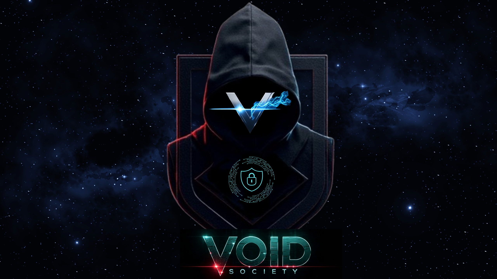

<h1 align="center">ethical-buddy@github</h1>

<p align="center">
  
</p>

<p align="center">
  
  
  
  
</p>

```console
$ ssh github.com/ethical-buddy

╭────────────────────────────────────────────────────────────────────╮
│ Suryansh Deshwal                                                   │
│ Systems . Security . Kernels . Networks . Open Source              │
╰────────────────────────────────────────────────────────────────────╯

> load profile
  role       Systems & Security Engineer
  stack      Go, C/C++, Rust, Python, x86-64 Assembly, Bash
  platform   Linux
  editor     Neovim / Vim
  target     technically difficult work that teaches something real

> current thesis
  abstractions are useful, but the interesting bugs live underneath.
```

## `/home/ethical-buddy/projects`

```text
.
├── vx6/
│   ├── ipv6-native node runtime
│   ├── encrypted forwarding and relays
│   ├── DHT-backed service discovery
│   └── peer-to-peer infrastructure
├── bumbelbee/
│   ├── boot to userspace
│   ├── memory, interrupts, syscalls
│   └── POSIX-inspired OS experiments
├── vimgo/
│   ├── terminal-first file manager
│   ├── keyboard-driven Linux workflow
│   └── Go TUI tooling
└── kernel-hacking/
    ├── eBPF, tracing, syscalls
    ├── low-level Linux experiments
    └── security through implementation detail
```

## `./map --layers`

```text
             applications  ── CLIs, CTI, automation, services
        distributed systems ── P2P, DHTs, relays, identity, crypto
                  network   ── IPv6, routing, raw sockets, packets
           linux / kernel   ── eBPF, syscalls, VFS, memory, tracing
                 hardware   ── x86-64, boot, interrupts, CPU state
```

## `./stack --badges`

<p>
  
</p>

| Tool | Mode |
| --- | --- |
| C / C++ | kernels, systems, networking, performance |
| Go | distributed services, network software, infrastructure |
| Rust | safe systems programming and security tooling |
| Python | research tooling, automation, CTI / OSINT |
| Assembly | x86-64, boot flow, architecture debugging |
| Bash | Linux automation, build systems, operations |

## `./research --interactive`

<details open>
<summary><b>open operating_systems.yml</b></summary>

```yaml
operating_systems:
  - kernel architecture
  - deterministic / replay-oriented execution
  - schedulers, VFS, memory and syscalls
  - low-level observability
```

</details>

<details>
<summary><b>open networking.yml</b></summary>

```yaml
networking:
  - IPv6-first infrastructure
  - decentralized service discovery
  - peer-to-peer overlay networks
  - SDN and packet processing
```

</details>

<details>
<summary><b>open security.yml</b></summary>

```yaml
security:
  - kernel / runtime security
  - reverse engineering
  - threat intelligence and OSINT
  - secure distributed systems
```

</details>

## `./telemetry`

<p align="center">
  
</p>

<p align="center">
  
  
</p>

## `./connect`

```text
signal > noise

build things close to the machine
read the implementation
question assumptions
contribute upstream
document what you learn
repeat
```

<p align="center">
  <b>I do not just want to use systems. I want to know why they work, where they fail, and how to build better ones.</b>
</p>
